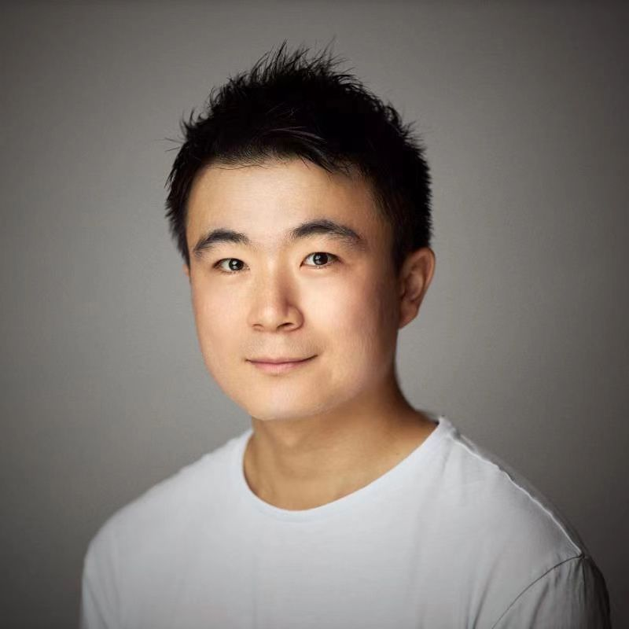

```{r, include=FALSE}
knitr::opts_chunk$set(
  results='asis', 
  echo = FALSE
)

source("script/cv_printing_functions.r")

# Read in all data and initialize a CV printer object
CV <- create_CV_object(
  data_location = "./data/",  
  pdf_mode = params$pdf_mode
)

```


```{r}
# When in pdf export mode the little dots are unaligned, so fix that with some conditional CSS.
if(params$pdf_mode) {
    cat("
<style>
:root{
  --decorator-outer-offset-left: -6.5px;
}
</style>")
}
```


Aside
================================================================================

{width=80%}

```{r}
# # Build interactive network of positions colored by section
# # and connected if they occurred in the same year
# datadrivencv::build_network_logo(CV$entries_data)
```


```{r}
if(params$pdf_mode){
  cat("View this CV online with links at _github.com/2003100127/profiler_")
} else {
  # cat("[<i class='fas fa-download'></i> Download a PDF of this CV](../pdf/jsun-cv.pdf)")
  cat("[<i class='fas fa-download'></i> Download a PDF of this CV](jsun-cv.pdf)")
}
```

Contact {#contact}
--------------------------------------------------------------------------------

```{r}
CV |> print_contact_info()
```


Language Skills {#skills}
--------------------------------------------------------------------------------

```{r}
CV |> print_skill_bars()
```


Disclaimer {#disclaimer}
--------------------------------------------------------------------------------

<!-- Made with the R package [**pagedown**](https://github.com/rstudio/pagedown).  -->

<!-- The source code is available [on github.com/2003100127/cv](./). -->

Last updated on `r Sys.Date()`.


Main
================================================================================

Jianfeng Sun {#title}
--------------------------------------------------------------------------------

### computational biology, artificial intelligence, data science

```{r}
# Note the assignment back to CV. This is so the link stripping works properly in PDF mode
CV <- print_text_block(CV, "introduction") 
```


Education {data-icon=graduation-cap data-concise=true}
--------------------------------------------------------------------------------

```{r}
CV <- print_section(CV, 'education')
```


Research Experience {data-icon=laptop}
--------------------------------------------------------------------------------

```{r}
CV <- print_section(CV, 'research_experience')
```


Professional service {data-icon=suitcase}
--------------------------------------------------------------------------------

```{r}
CV <- print_section(CV, 'professional_service')
```

<!-- These breaks just force a new page so section doesnt get cut off -->
<br>
<br>
<br>

Thesis {data-icon=user-graduate}
--------------------------------------------------------------------------------

```{r}
CV <- print_section(CV, 'thesis')
```


Academic Publication {data-icon=book}
--------------------------------------------------------------------------------

```{r}
CV <- print_section(CV, 'academic_publication')
```

::: aside
```{r}
CV <- print_text_block(CV, 'academic_publication_aside')
```
:::


Patent {data-icon=chart-line}
--------------------------------------------------------------------------------

```{r}
CV <- print_section(CV, 'patent')
```

::: aside
```{r}
CV <- print_text_block(CV, 'patent_aside')
```
:::


Funding  {data-icon=wallet}
--------------------------------------------------------------------------------

```{r}
CV <- print_section(CV, 'funding')
```


Software copyright  {data-icon=copyright}
--------------------------------------------------------------------------------

```{r}
CV <- print_section(CV, 'software_copyright')
```


<br>
<br>


Scientific program  {data-icon=newspaper}
--------------------------------------------------------------------------------

```{r}
CV <- print_section(CV, 'scientific_program')
```


Conference  {data-icon=comments}
--------------------------------------------------------------------------------

```{r}
CV <- print_section(CV, 'conference')
```


Open Talk  {data-icon=user-group}
--------------------------------------------------------------------------------

```{r}
CV <- print_section(CV, 'talk')
```


Award {data-icon=award}
--------------------------------------------------------------------------------

```{r}
CV <- print_section(CV, 'award')
```


Computational tool {data-icon=tools}
--------------------------------------------------------------------------------

::: aside
```{r}
CV <- print_text_block(CV, 'computational_tool_aside')
```
:::

```{r}
CV <- print_section(CV, 'computational_tool')
```


```{r}
print_links(CV)
```

